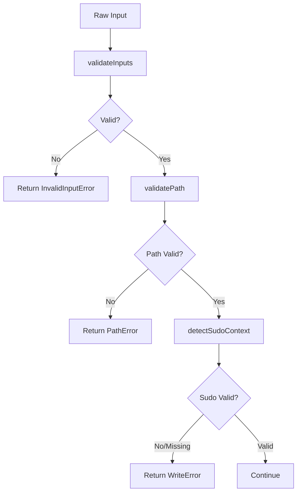
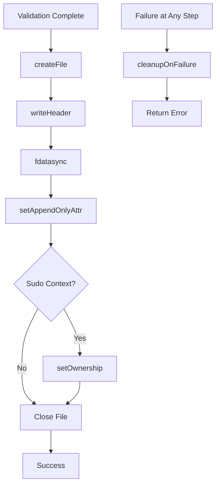
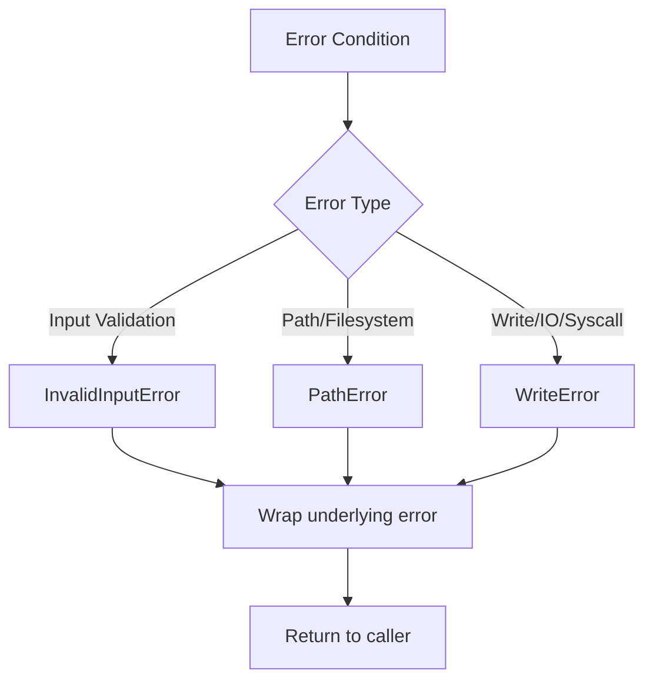

# Data Model: frozenDB File Creation

## Phase 1: Data Model & Contracts

## Core Data Structures

### frozenDB File Header

```go
// Header represents frozenDB v1 text-based header format
// Header is exactly 64 bytes: JSON content + null padding + newline
type Header struct {
    Signature string    // Always "fDB" 
    Version   int      // Always 1 for v1 format
    RowSize   int      // Size of each data row in bytes (128-65536)
    SkewMs    int      // Time skew window in milliseconds (0-86400000)
}

const (
    HeaderSize = 64                // Fixed header size in bytes
    HeaderSignature = "fDB"        // Signature string for format identification
    MinRowSize = 128               // Minimum allowed row size
    MaxRowSize = 65536             // Maximum allowed row size  
    MaxSkewMs  = 86400000          // Maximum time skew (24 hours)
    PaddingChar = '\x00'             // Null character for header padding
    HeaderNewline = '\n'            // Byte 63 must be newline
)
```

### Header Format String

```go
// HeaderFormat defines the exact text format for frozenDB v1 headers
// Format: {sig:"fDB",ver:1,row_size:<size>,skew_ms:<skew>}\x00\x00\x00\x00\n
const HeaderFormat = `{sig:"fDB",ver:1,row_size:%d,skew_ms:%d}`
```

### Header Generation

```go
// GenerateHeader creates the 64-byte header string with proper padding
func GenerateHeader(rowSize, skewMs int) ([]byte, error) {
    // Generate JSON content
    jsonContent := fmt.Sprintf(HeaderFormat, rowSize, skewMs)
    
    // Calculate padding needed (total 64 bytes, minus newline at end)
    contentLength := len(jsonContent)
    if contentLength > 51 {
        return nil, errors.New("header content too long")
    }
    
    // Calculate padding: 63 - jsonContent length (byte 63 is newline)
    paddingLength := 63 - contentLength
    padding := strings.Repeat(string(PaddingChar), paddingLength)
    
    // Assemble header: JSON + padding + newline
    header := jsonContent + padding + string(HeaderNewline)
    
    return []byte(header), nil
}
```

### Error Hierarchy

```go
// Base error type (constitutional requirement)
type FrozenDBError struct {
    Code    string
    Message string
    Err     error
}

func (e *FrozenDBError) Error() string
func (e *FrozenDBError) Unwrap() error

// Specific error types for different behaviors
type InvalidInputError struct {
    FrozenDBError
}

type PathError struct {
    FrozenDBError
}

type WriteError struct {
    FrozenDBError
}
```

### Sudo Context

```go
type SudoContext struct {
    User    string  // Original username from SUDO_USER
    UID     int     // Original user ID from SUDO_UID
    GID     int     // Original group ID from SUDO_GID
    IsValid bool    // Whether sudo context is valid and complete
}
```

## Function Signatures

### Public API

```go
// CreateConfig holds configuration for creating a new frozenDB database file
type CreateConfig struct {
    Path     string // Filesystem path for the database file
    RowSize  int    // Size of each data row in bytes (128-65536)
    SkewMs   int    // Time skew window in milliseconds (0-86400000)
}

// Validate validates the CreateConfig and returns appropriate error types
func (cfg *CreateConfig) Validate() error

// Create creates a new frozenDB database file with the given configuration
func Create(config CreateConfig) error

// NewCreateConfig creates a CreateConfig with the given parameters
func NewCreateConfig(path string, rowSize, skewMs int) CreateConfig
```

### Internal Functions

```go
// validateInputs performs all input validation from CreateConfig (no side effects)
func validateInputs(config CreateConfig) error

// validatePath validates path and filesystem preconditions
func validatePath(path string) error

// detectSudoContext detects and validates sudo environment
func detectSudoContext() (*SudoContext, error)

// createFile atomically creates the file with proper permissions
func createFile(path string) (*os.File, error)

// writeHeader writes the frozenDB v1 header to file descriptor
func writeHeader(fd int, config CreateConfig) error

// setAppendOnlyAttr sets the append-only attribute using ioctl
func setAppendOnlyAttr(fd int) error

// setOwnership changes file ownership if running under sudo
func setOwnership(path string, sudoCtx *SudoContext) error

// cleanupOnFailure removes partially created file
func cleanupOnFailure(path string)
```

## Constants and Magic Values

### File System

```go
const (
    // File permissions: 0644 (owner rw, group/others r)
    FilePermissions = 0644
    
    // Atomic file creation flags
    O_CREAT_EXCL = syscall.O_CREAT | syscall.O_EXCL
)

// Linux syscall constants for append-only attribute
const (
    FS_IOC_GETFLAGS = 0x80086601  // Get file flags
    FS_IOC_SETFLAGS = 0x40086602  // Set file flags  
    FS_APPEND_FL    = 0x00000020  // Append-only flag
)
```

### Validation

```go
const (
    // Parameter validation ranges
    MinRowSize = 128
    MaxRowSize = 65536
    MaxSkewMs  = 86400000  // 24 hours in milliseconds
    
    // File extension requirement
    FileExtension = ".fdb"
    
    // Header signature string
    HeaderSignature = "fDB"
)
```

## Data Flow

### Input Processing



### File Creation Process



### Error Handling Flow



## File Layout

### frozenDB v1 Format

```
+------------------+------------------+
| Header (64 bytes)| Data Rows         |
+------------------+------------------+
| JSON + Padding    | Row 0             |
| (bytes 0-62)     | (bytes 64 onwards) |
| Byte 63 = '\n'   | (RowSize bytes)    |
+------------------+------------------+

Header Structure (exactly 64 bytes):
+------------------+------------------+
| JSON Content      | Null Padding     |
| {sig:"fDB"...}  | (\x00\x00\x00\x00)   |
| (44-51 bytes)    | (13-20 bytes)    |
+------------------+------------------+
| Byte 63          |
| '\n' (newline)   |
+------------------+------------------+

Exact Format Example:
{sig:"fDB",ver:1,row_size:1024,skew_ms:5000}\x00\x00\x00\x00\x00\x00\x00\x00\x00\x00\x00\x00\x00\n
<-- JSON content --><-- 13-20 padding nulls --><- \n ->
    (44-51 bytes)           (13-20 bytes)     (1 byte)
```